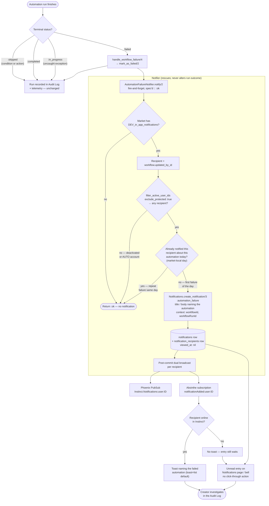

# Top-level Behavior

## Diagram

## Summary

Every automation run still lands in the Audit Log and telemetry unchanged; only a `:failed` terminal transition branches into the new `AutomationFailureNotifier`. The notifier is a fire-and-forget side path with three sequential gates — the market's `DEV_in_app_notifications` flag, an active/non-protected recipient (`workflow.updated_by_id`), and a market-local-day dedup query keyed on `(automation, recipient, day)`. Passing all three creates one `:automation_failure` notification, which fans out post-commit to a toast (if the recipient is online) and a persistent unread entry naming the automation. Any gate failing returns `:ok` silently, and the notifier can never alter the run's outcome.
