# Mermaid Diagram Patterns

Templates for mermaid diagrams used at each design level. Includes both
OOP and FP variants where they differ.

## Level 2: Components

### Class Diagram (OOP)

Use to show components, their attributes, methods, and relationships.

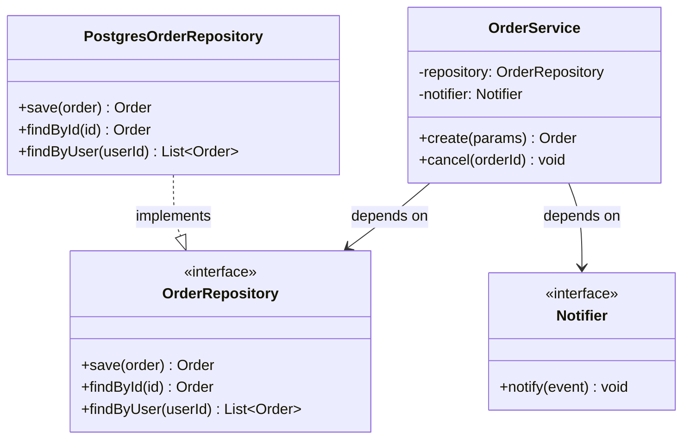

### Module Diagram (FP)

Use to show modules, their public functions, and relationships.

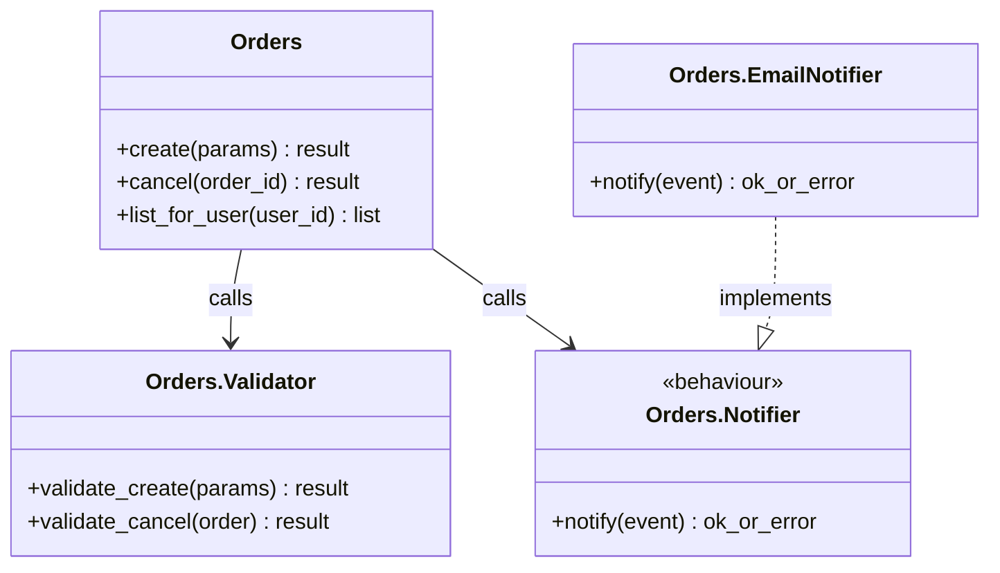

### Component Diagram

Use for high-level system overview when class/module detail is too granular.

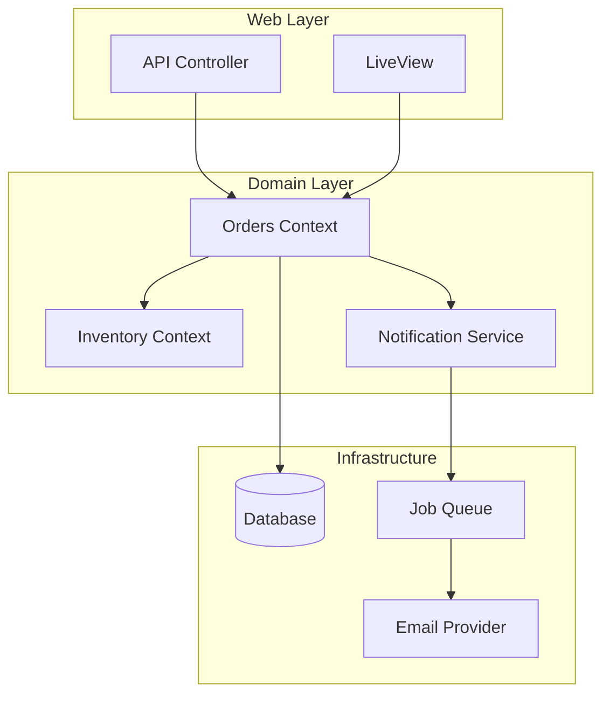

## Level 3: Interactions

### Sequence Diagram

Use to show the order of operations between components for a specific scenario.

**OOP variant:**

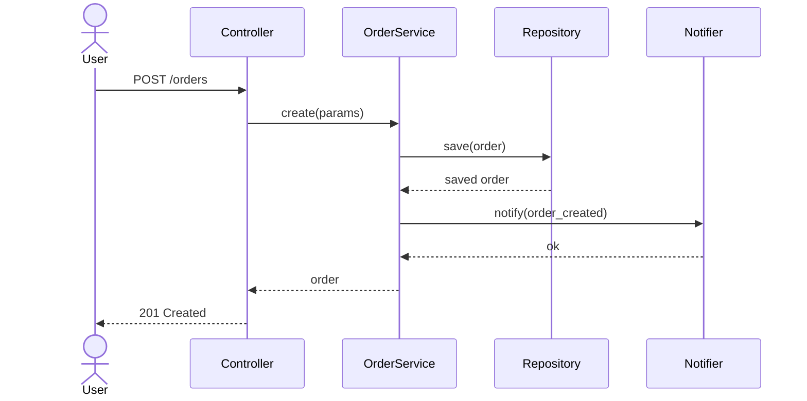

**FP variant:**

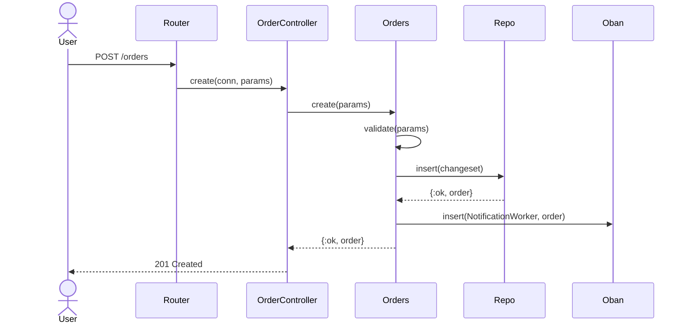

### Flowchart

Use for decision logic, branching paths, or process flows.

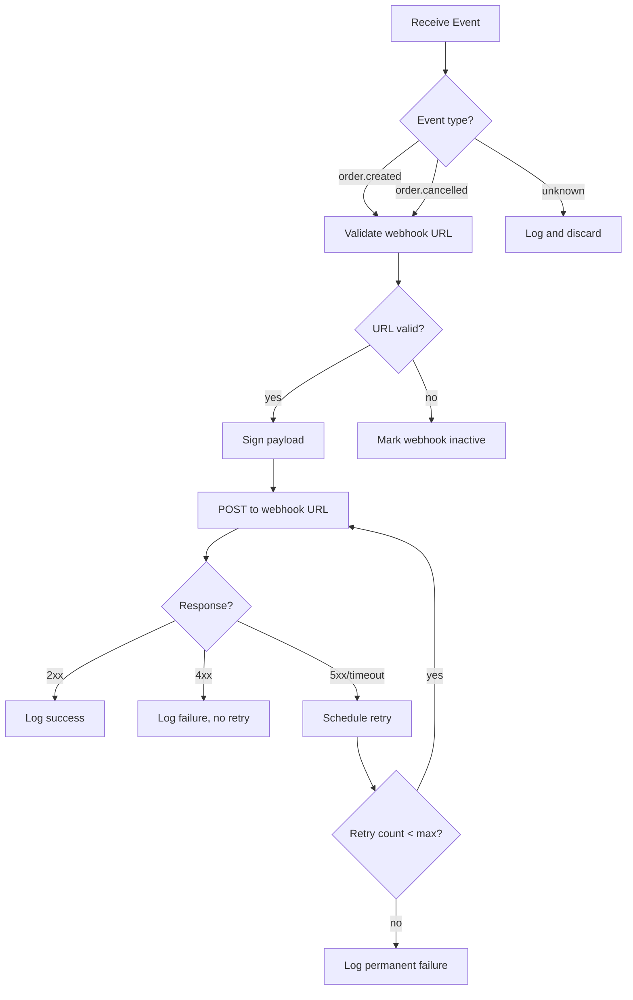

### Data Flow Diagram (FP)

Use to show data transformation pipelines.

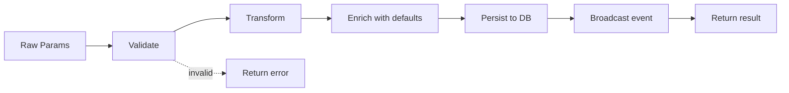

### State Machine Diagram

Use for components with well-defined states and transitions.

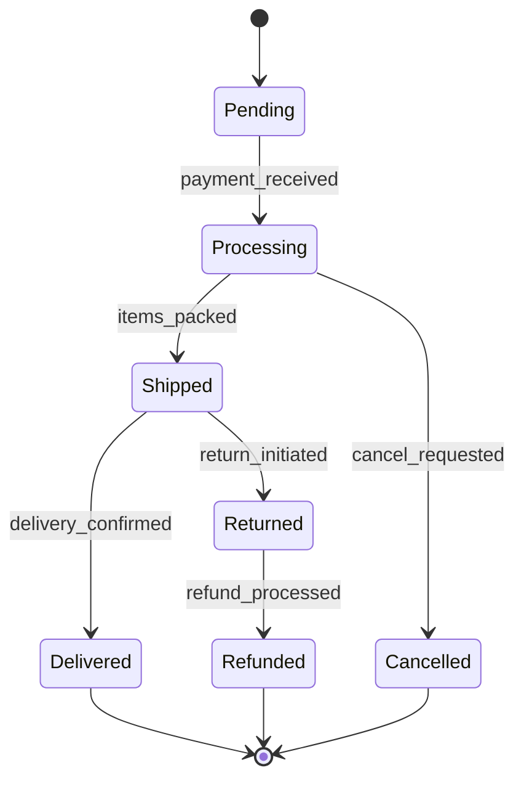

## Level 4: Contracts

### Interface Diagram (OOP)

Use to show interfaces, their methods, and implementing classes.

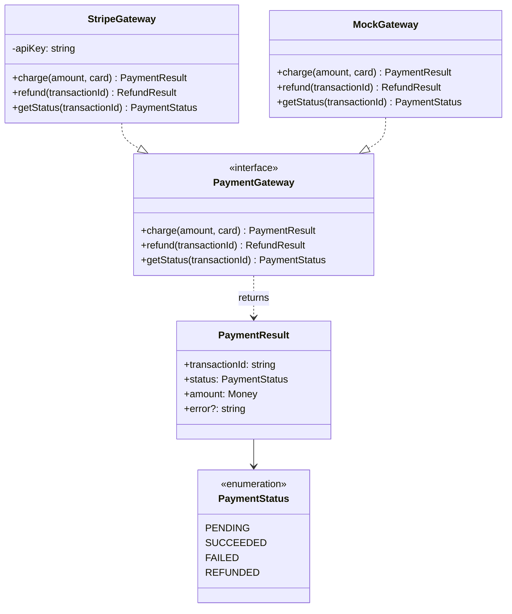

### Type Relationship Diagram (FP)

Use to show types, specs, and behaviour contracts.

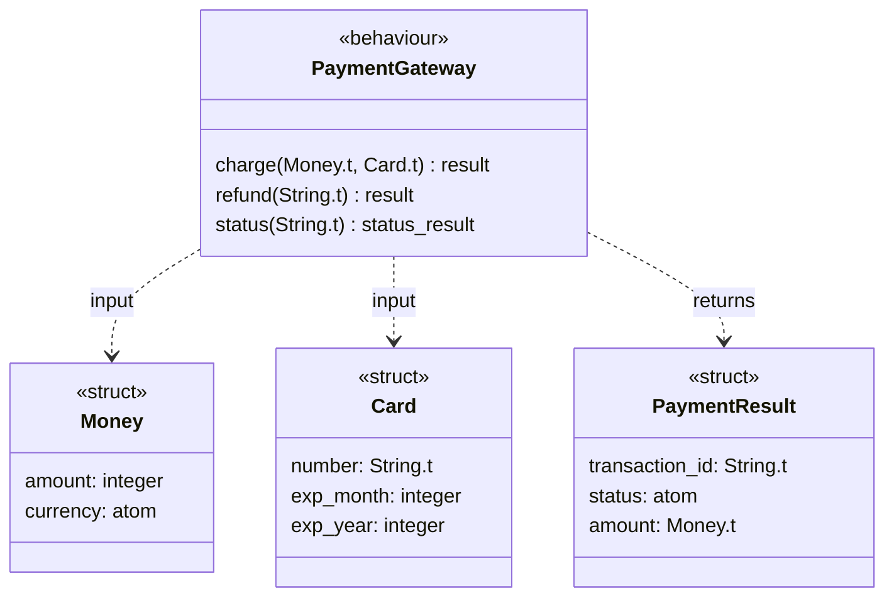

### Supervision Tree Diagram (FP/OTP)

Use to show process supervision hierarchies.

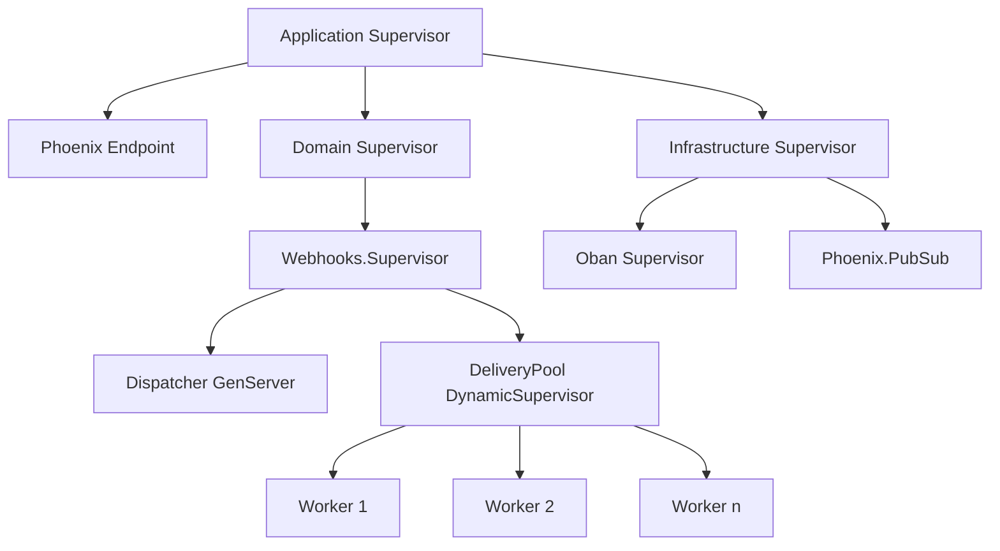

## Diagram Selection Guide

| Level | Scenario | Diagram Type |
|---|---|---|
| Level 2 | Show component responsibilities (OOP) | Class diagram |
| Level 2 | Show module responsibilities (FP) | Module diagram |
| Level 2 | High-level system overview | Component diagram |
| Level 3 | Trace a request through components | Sequence diagram |
| Level 3 | Show decision/branching logic | Flowchart |
| Level 3 | Show data transformation pipeline | Data flow diagram |
| Level 3 | Show state transitions | State machine diagram |
| Level 4 | Show interfaces and implementations (OOP) | Interface diagram |
| Level 4 | Show types and behaviour contracts (FP) | Type relationship diagram |
| Level 4 | Show process supervision (OTP) | Supervision tree diagram |

## Tips

- Keep diagrams focused. One diagram per concern, not one diagram for everything.
- Use `subgraph` to group related components visually.
- Label arrows with the interaction type (method name, message, event).
- Use dashed lines (`-.->` or `..>`) for optional or async relationships.
- Use solid lines (`-->` or `-->>`) for required/synchronous relationships.
- Prefer top-to-bottom (`TD`) for hierarchies, left-to-right (`LR`) for pipelines.
- Include a brief text description alongside each diagram for context.
