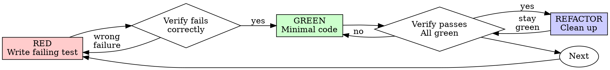

# Test-Driven Development (TDD)

## Overview

Write the test first. Watch it fail. Write minimal code to pass.

**Core principle:** If you didn't watch the test fail, you don't know if it tests the right thing.

**Violating the letter of the rules is violating the spirit of the rules.**

## Quick Start

1. Write one failing test describing desired behavior
2. Run it - confirm it fails for the right reason
3. Write minimal code to pass
4. Run it - confirm it passes
5. Refactor if needed, keeping tests green

## When to Use

**Always:**
- New features
- Bug fixes
- Refactoring
- Behavior changes

**Exceptions (ask your human partner):**
- Throwaway prototypes
- Generated code
- Configuration files

Thinking "skip TDD just this once"? Stop. That's rationalization.

## The Iron Law

```
NO PRODUCTION CODE WITHOUT A FAILING TEST FIRST
```

Write code before the test? Delete it. Start over.

**No exceptions:**
- Don't keep it as "reference"
- Don't "adapt" it while writing tests
- Don't look at it
- Delete means delete

Implement fresh from tests. Period.

## Red-Green-Refactor



### RED - Write Failing Test

Write one minimal test showing what should happen.

**Good:**
```typescript
test('retries failed operations 3 times', async () => {
  let attempts = 0;
  const operation = () => {
    attempts++;
    if (attempts < 3) throw new Error('fail');
    return 'success';
  };

  const result = await retryOperation(operation);

  expect(result).toBe('success');
  expect(attempts).toBe(3);
});
```
Clear name, tests real behavior, one thing.

**Bad:**
```typescript
test('retry works', async () => {
  const mock = jest.fn()
    .mockRejectedValueOnce(new Error())
    .mockRejectedValueOnce(new Error())
    .mockResolvedValueOnce('success');
  await retryOperation(mock);
  expect(mock).toHaveBeenCalledTimes(3);
});
```
Vague name, tests mock not code.

**Requirements:**
- One behavior
- Clear name
- Real code (no mocks unless unavoidable)

**Catchable defect check.** Before writing, ask: *would deleting this test let a real bug go undetected?* If the only answer is "only if I changed one literal and forgot the matching one," or "an integration test would catch it anyway," the test is tautological — re-scope the cycle to a consumer transformation. Keep it only when the answer names a real branching or transformation defect, or when the contract is consumed outside this codebase and no higher-level test already pins it. Do not write a test you can satisfy with a literal. For the full excuse table, see [anti-patterns.md](../reviewing-test-design/references/anti-patterns.md).

**The Red step's unit is a failing check, not a new test function.** When the next increment of behavior is another observable consequence of a behavior an existing test already exercises — or another row in a table-driven test — express it as a new assertion or a new case in that test rather than a new test function. Two rules bound this, without exception:

1. **Additive only.** Never relax, delete, or loosen an existing assertion to produce Red. If an existing assertion is now wrong, that is a separate, deliberate change with its own justification — not a Red step.
2. **Still verified red.** Run the modified test and confirm it fails *on the new assertion*, for the expected reason. A modified test that goes red on an *old* assertion means you broke something — stop and fix that first.

One behavior per test still holds. One behavior is not one assertion. If the new assertion needs its own sentence to describe what it checks, it is a different behavior — write a new test.

### Verify RED - Watch It Fail

**MANDATORY. Never skip.**

Run the project's test command for this file alone (`mix test path/to/file_test.exs:LINE`, `npm test path/to/test.test.ts`, `pytest path/to/test.py::test_name`).

Confirm:
- Test fails (not errors)
- Failure message is expected
- Fails because feature missing (not typos)
- Added an assertion to an existing test? It fails on that assertion, not an old one

**Test passes?** It is asserting behavior that already exists. Add the assertion that pins the behavior you have *not* built yet — do not weaken or remove an assertion to force a failure. If nothing you can add fails, the increment is already implemented; pick the next one.

**Test errors?** Fix error, re-run until it fails correctly.

### GREEN - Minimal Code

Write simplest code to pass the test.

**Good:**
```typescript
async function retryOperation<T>(fn: () => Promise<T>): Promise<T> {
  for (let i = 0; i < 3; i++) {
    try {
      return await fn();
    } catch (e) {
      if (i === 2) throw e;
    }
  }
  throw new Error('unreachable');
}
```
Just enough to pass.

**Bad:**
```typescript
async function retryOperation<T>(
  fn: () => Promise<T>,
  options?: {
    maxRetries?: number;
    backoff?: 'linear' | 'exponential';
    onRetry?: (attempt: number) => void;
  }
): Promise<T> {
  // YAGNI
}
```
Over-engineered.

Don't add features, refactor other code, or "improve" beyond the test.

### Verify GREEN - Watch It Pass

**MANDATORY.**

Run the project's test command for this file alone (`mix test path/to/file_test.exs:LINE`, `npm test path/to/test.test.ts`, `pytest path/to/test.py::test_name`).

Confirm:
- Test passes
- Other tests still pass
- Output pristine (no errors, warnings)

**Test fails?** Fix code, not test.

**Other tests fail?** Fix now.

### REFACTOR - Clean Up

After green only:
- Remove duplication
- Improve names
- Extract helpers

Keep tests green. Don't add behavior.

For systematic refactoring with code smell detection, see the [refactoring-code](../refactoring-code/SKILL.md) skill.

### Repeat

Next failing check for the next increment of behavior.

## Good Tests

| Quality | Good | Bad |
|---------|------|-----|
| **Minimal** | One thing. "and" in name? Split it. | `test('validates email and domain and whitespace')` |
| **Clear** | Name describes behavior | `test('test1')` |
| **Shows intent** | Demonstrates desired API | Obscures what code should do |

## Common Rationalizations

| Excuse | Reality |
|--------|---------|
| "Too simple to test" | Simple code breaks. Test takes 30 seconds. |
| "I'll test after" | Tests passing immediately prove nothing. |
| "Tests after achieve same goals" | Tests-after = "what does this do?" Tests-first = "what should this do?" |
| "Already manually tested" | Ad-hoc ≠ systematic. No record, can't re-run. |
| "Deleting X hours is wasteful" | Sunk cost fallacy. Keeping unverified code is technical debt. |
| "Keep as reference, write tests first" | You'll adapt it. That's testing after. Delete means delete. |
| "Need to explore first" | Fine. Throw away exploration, start with TDD. |
| "Test hard = design unclear" | Listen to test. Hard to test = hard to use. |
| "TDD will slow me down" | TDD faster than debugging. Pragmatic = test-first. |
| "Manual test faster" | Manual doesn't prove edge cases. You'll re-test every change. |
| "Existing code has no tests" | Characterization tests pin current behavior first. See below. |
| "The plan says assert this literal" | Mirror-of-source isn't a test. Re-scope the cycle to a consumer transformation. See [anti-patterns.md](../reviewing-test-design/references/anti-patterns.md). |

Arguing to skip the cycle — yours or your human partner's — read [rationalizations.md](references/rationalizations.md) for the full rebuttal to each excuse.

## Characterization Tests for Untested Code

Characterization tests for pre-existing untested code are not a TDD cycle — they pin current behavior before you change it. Write them, watch them pass, then resume Red-Green-Refactor for the change itself.

This is the one case where a passing test is the expected outcome. It applies only to code that existed before this task. Code you wrote yourself and did not test first is not legacy — delete it and start over.

## Red Flags - STOP and Start Over

- Code before test
- Test after implementation
- Test — or a new assertion in an existing test — passes immediately
- An existing assertion relaxed, loosened, or deleted to produce Red
- Can't explain why test failed
- Tests added "later" for code you just wrote
- Rationalizing "just this once"
- "I already manually tested it"
- "Tests after achieve the same purpose"
- "It's about spirit not ritual"
- "Keep as reference" or "adapt existing code"
- "Already spent X hours, deleting is wasteful"
- "TDD is dogmatic, I'm being pragmatic"
- "This is different because..."

**All of these mean: Delete code. Start over with TDD.**

## Example: Bug Fix

**Bug:** Empty email accepted

**RED**
```typescript
test('rejects empty email', async () => {
  const result = await submitForm({ email: '' });
  expect(result.error).toBe('Email required');
});
```

**Verify RED**
```bash
$ npm test src/submitForm.test.ts
FAIL: expected 'Email required', got undefined
```

**GREEN**
```typescript
function submitForm(data: FormData) {
  if (!data.email?.trim()) {
    return { error: 'Email required' };
  }
  // ...
}
```

**Verify GREEN**
```bash
$ npm test src/submitForm.test.ts
PASS
```

**REFACTOR**
Extract validation for multiple fields if needed.

## Verification Checklist

Before marking work complete:

- [ ] Every new behavior has a test that would fail against a real defect, not only against an out-of-sync literal
- [ ] Watched each test fail before implementing
- [ ] Each test failed for expected reason (feature missing, not typo)
- [ ] Wrote minimal code to pass each test
- [ ] All tests pass
- [ ] Output pristine (no errors, warnings)
- [ ] Tests use real code (mocks only if unavoidable)
- [ ] Edge cases and errors covered

Can't check all boxes? You skipped TDD. Start over.

## When Stuck

| Problem | Solution |
|---------|----------|
| Don't know how to test | Write wished-for API. Write assertion first. Ask your human partner. |
| Test too complicated | Design too complicated. Simplify interface. |
| Must mock everything | Code too coupled. Use dependency injection. |
| Test setup huge | Extract helpers. Still complex? Simplify design. |

## Debugging Integration

Bug found? Write failing test reproducing it. Follow TDD cycle. Test proves fix and prevents regression.

Never fix bugs without a test.

## Testing Anti-Patterns

When adding mocks or test utilities, see [Testing Anti-Patterns](testing-anti-patterns.md) to avoid common pitfalls:
- Testing mock behavior instead of real behavior
- Adding test-only methods to production classes
- Mocking without understanding dependencies

## Final Rule

```
Production code → test exists and failed first
Otherwise → not TDD
```

No exceptions without your human partner's permission.
